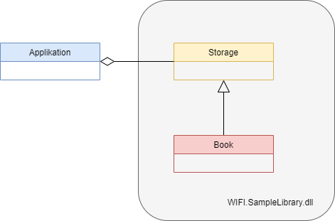

# C# Aubau
Examples from our C# journey 2022

# Kapitel 1 - Aufzählungen
Dies ist ein Beschreibung...

- dies
- das
- und das noch...


## Kapitel 2 - Bilder



### Kapitel 3 - Implementierung

Hier ein Auszug aus dem Code:

```csharp
internal class Book
{
    public string Title { get; set; }
    public string Author { get; set; }
    public decimal Price { get; set; }
    public int DateOfPublish { get; set; }
    public string Isbn { get; set; }
    public BookGenre Genre { get; set; }
}
```

Hier gehts zum [Repository](https://github.com/atillakati/csharp-aufbau-2022-trainer)!

See the [Markdown guide](https://www.markdownguide.org/basic-syntax/) for more details!