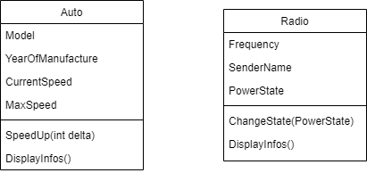

# Wiederholung Kapselung
## Beispiel
Folgende Klassen sollen umgesetzt werden:



Dabei ist auf folgendes zu achten:
- jede Klasse in eine eigene Datei
- Klassen sollen einen vernünftigen Konstruktor haben
- **keine public Fields** in den Klassen

## Eigenschaften

Eigenschaften sind echte **Zugriffs- und Änderungsmethoden** und gehören zu der öffentlichen std. Schnittstelle. Eigenschaften regeln den Zugriff auf die Daten über eine Instanz der Klasse und sind "eigentlich" nur für den Gebrauch von aussen gedacht.

```csharp
private int _maxSpeed;

public int MaxSpeed
{
    get { return _maxSpeed; }
    //set { _maxSpeed = value; }  
}
```

## Konstruktor

Konstruktoren sollen die **Objekt Konsistenz** nach der Erzeugung dieser sicherstellen. Ein Objekt soll sofort nach der Erzeugung (Instanziierung) einsatzbereit sein. Jede instanziierbare Klasse, hat mind. einen Konstruktor. Der Konstruktor ohne Parameter wird als der **standard Konstruktor** bezeichnet. 

Dort wo es auch sinnvoll ist, einen standard Konstruktor anbieten! Im Beispiel unten ist es nicht wirklich sinnvoll.. ;-)

```csharp
internal class Auto
{
    private string _model;
    private int _yearOfManufacture;
    private int _currentSpeed;
    private int _maxSpeed;

    //std. constructor
    public Auto()
    {
        //set default vaules (if possible)
        _model = "Default Car V4";
        _yearOfManufacture = 2010
        _maxSpeed = 150;
        _currentSpeed = 0;
    }

    //user specific contructor
    public Auto(string model, int yearOfManufacture, int maxSpeed)
    {
        _model = model;
        _yearOfManufacture = yearOfManufacture;
        _maxSpeed = maxSpeed;
        _currentSpeed = 0;
    }
}
```