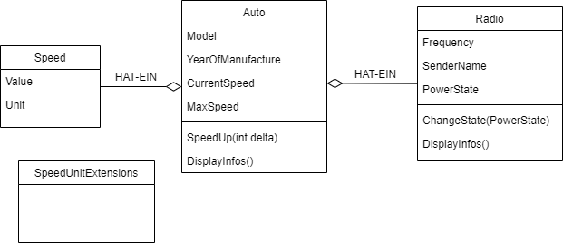

# Wiederholung Vererbung
## Beispiel
Folgende Klassen sollen umgesetzt werden:

Dabei ist auf folgendes zu achten:
- jede Klasse in eine eigene Datei
- Klassen sollen einen vernünftigen Konstruktor haben
- **keine public Fields** in den Klassen
