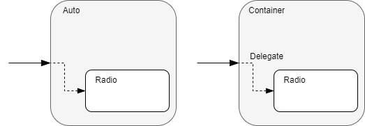

# Wiederholung Vererbung
## Beispiel
Folgende Klassen sollen umgesetzt werden:


Dabei ist auf folgendes zu achten:
- jede Klasse in eine eigene Datei
- Klassen sollen einen vernünftigen Konstruktor haben
- **keine public Fields** in den Klassen

## Extension Methods
Extension Methods sind eine Möglichkeit einen Typen mit ext. Membern zu erweitern. Besonders hilfreich ist diese Technik, wenn der Typ mit  konventionellen Methoden (Vererbung, Code Erweiterung) **nicht** ertweitert werden kann.

```csharp
internal static class SpeedUnitExtensions
{
    public static string GetUnitText(this SpeedUnit fromUnit)
    {
        var result = string.Empty;

        switch (fromUnit)
        {
            case SpeedUnit.MilesPerHour:
                result = "mph";
                break;
           //...
            default:
                result = "n.d.";
                break;
        }

        return result;
    }
}
```
Extension Methoden müssen sich in statischen Klassen befinden und müssen selbst auch statisch deklariert werden. Beispiel siehe Methode GetUnitText()!
Die Methode GetUnitText() erweitert den Datentyp SpeedUnit (eine Enum). Dies ist dem Schlüsselwort **this** zu verdanken. 

Die Anwendung der Mthode sie wie folgt aus:
```csharp
SpeedUnit speedUnit = SpeedUnit.KmPerHour;
var einheit = speedUnit.GetUnitText();
```

## Vererbung - HAT-EIN

Die Vererbung baut als zweite Säule der OOP auf die Erste auf. Datentypen, welche in eine Klasse eingebaut werden, müssen **richtig gekapselt** werden. Durch den Einbau, kann die übergeordnete Klasse (=Container) nun auf die Funktionalitäten der eingebauten Klasse zugreifen und diese bei Bedarf als eigene an die Öffentlichkeit weitergeben.



Dabei ist wichtig, dass der eingebaute Datentyp niemals preisgegben werden sollte ==> die eigene Implementierung verbergen! 
Dazu sollen in der übergeordneten Klasse eigene Member (Methoden, Eigenschaften) implementiert werden, welche die Anfragen einfach an das innere Objekt delegieren.

```csharp 
internal class Auto
{
    private Radio _autoRadio = new Radio();

    public double RadioFrequency
    {
        get { return _autoRadio.Frequency; }
    }

    public void ChangeRadioPower(bool isOn)
    {
        if (isOn)
        {
            _autoRadio.ChangeState(PowerState.On);
        }
        else
        {
            _autoRadio.ChangeState(PowerState.Off);
        }
    }
}
```
