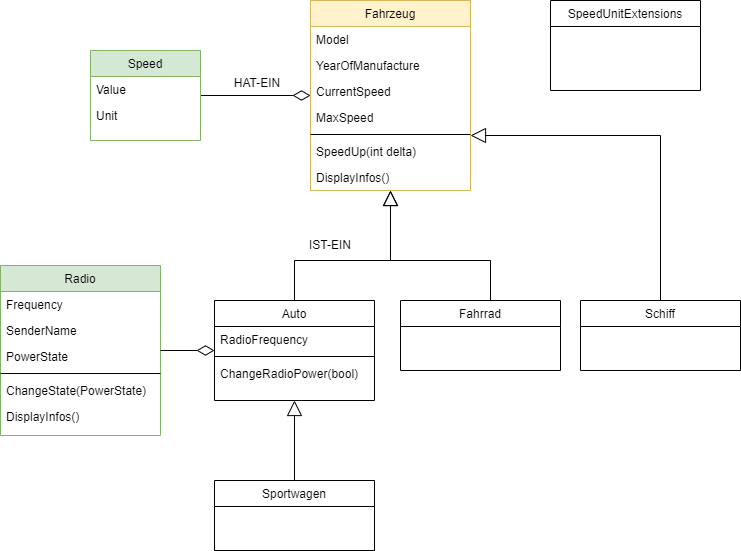

# Wiederholung Vererbung
## Beispiel
Folgende Klassen sollen umgesetzt werden:



Dabei ist auf folgendes zu achten:
- jede Klasse in eine eigene Datei
- Klassen sollen einen vernünftigen Konstruktor haben
- **keine public Fields** in den Klassen

## Vererbung - IST-EIN

Bei der klasseischen Vererbung wird eine IST-EIN Beziehung zwischen den Klassen hergestellt. Im UML Klassendiagramm wird diese Beziehung mit einem Pfeil Richtung der Verallgemeinerung abgebildet. Auch sollte der semantische Zusammenhang richtig sein:

**Sportwagen IST EIN Auto IST EIN Fahrzeug**
Wenn in dieser Aussage etwas nicht stimmt, dann ist das Modell falsch.

Der Syntax für die IST-EIN Beziehung ist der Doppelpunkt. Die Klasse **Auto** leitet sich von der Klasse **Fahrzeug** ab. Dabei wird die gesamte öffentliche std. Schnittstelle (alle public Member) des Fahrzeug vererbt.

```csharp
public class Fahrzeug
{
    //...
}

public class Auto : Fahrzeug
{
    //...
}
```

### Konstruktor Logik

Soll eine abgeleitete Klasse instanziert werden, wird **immer zuerst die Basisklasse** instanziert. Dazu wird per default der **std. Konstruktor** verwendet. Wenn die Basis-Klasse keinen std. Konstruktor definiert hat, kommt es zu einer Fehlermeldung.
Um dieses Problem in den Griff zu bekommen, kann in der Subklasse, der zu verwendende Basisklassen-Konstruktor angegeben werden.

```csharp
public Auto(string model, int yearOfManufacture)
            : base(model, yearOfManufacture, new Speed { Unit= SpeedUnit.KmPerHour, Value=180})
{
    _autoRadio = new Radio();
    _autoRadio.SenderName = "Hitradio V2";
}
```

Die Parameter ```model``` und ```yearOfManufacture``` werden hier einfach an die Basisklasse weitergeleitet und dort für die Initialisierung verwendet. Um den Sourcecode übersichtlich zu halten, sollte jede Klasse nur die eigenen Elemente initialisieren. ```model``` und ```yearOfManufacture``` sind Elemente, welche in der Basisklasse definiert sind. Deshalb sollten sie auch an die Basisklasse übergeben werden.

### Typkompatibilität

Durch die erzeugte IST-Ein Beziehung in diesem Beispiel ist folgender Code möglich:

```csharp
static void Main(string[] args)
{
    var fahrzeugListe = new Fahrzeug[]
    {
        new Auto(),
        new Sportwagen("Spider", 2020, new Speed{Unit = SpeedUnit.KmPerHour, Value=250}, 8),
        new Fahrrad("KTM SuperSpeed", 2000, 50.0),
        new Schiff(500.5, "MegaTransporter", 1950, new Speed{Value= 8, Unit= SpeedUnit.MetersPerSecond}),              
    };

    ShowVehicleInfos(fahrzeugListe);
}

private static void ShowVehicleInfos(IEnumerable<Fahrzeug> vehicelList)
{
    foreach (var vehicle in vehicelList)
    {
        vehicle.SpeedUp(new Speed { Value = 2, Unit = SpeedUnit.MetersPerSecond });
        vehicle.DisplayInfos();
    }
}
```

Ein besonderes Augenmerk ist auf die Methode ```ShowVehicleInfos()``` zu legen. Als Parametertyp ist in der Signatur eine Fahrzeug Collection definiert (IEnumerable<>). Somit akzeptiert diese Methode jede Form von Collections als Parameter.
Im ```Main()``` wird ein ```Fahrzeug[]``` definiert. In dieses Array werden nun alle Fahrzeugtypen instanziert. Dies ist möglich, weil für alle Klassen die Beziehung xy IST EIN Fahrzeug gilt. Somit sind diese verschiedenen Fahrzeug-Klassen **Typ-Kompatibel** und können gleich behandelt werden.