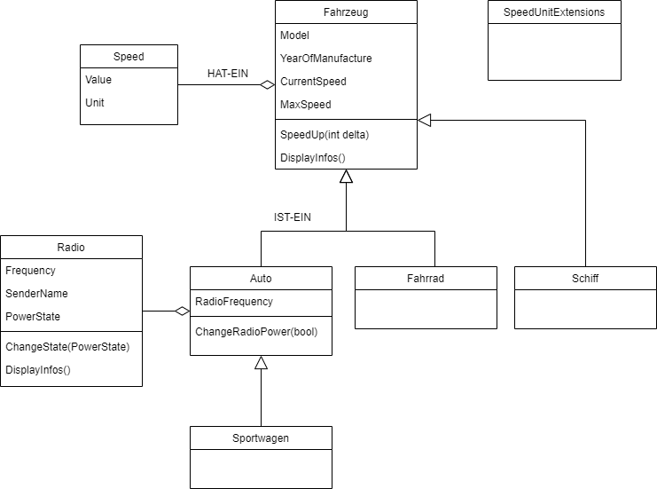

# Wiederholung Vererbung
## Beispiel
Folgende Klassen sollen umgesetzt werden:



Dabei ist auf folgendes zu achten:
- jede Klasse in eine eigene Datei
- Klassen sollen einen vernünftigen Konstruktor haben
- **keine public Fields** in den Klassen

## Vererbung - IST-EIN

Bei der klasseischen Vererbung wird eine IST-EIN Beziehung zwischen den Klassen hergestellt. Im UML Klassendiagramm wird diese Beziehung mit einem Pfeil Richtung der Verallgemeinerung abgebildet. Auch sollte der semantische Zusammenhang richtig sein:

**Sportwagen IST EIN Auto IST EIN Fahrzeug**
Wenn in dieser Aussage etwas nicht stimmt, dann ist das Modell falsch.

Der Syntax für die IST-EIN Beziehung ist der Doppelpunkt. Die Klasse **Auto** leitet sich von der Klasse **Fahrzeug** ab. Dabei wird die gesamte öffentliche std. Schnittstelle (alle public Member) des Fahrzeug vererbt.

```csharp
public class Fahrzeug
{
    //...
}

public class Auto : Fahrzeug
{
    //...
}
```

### Konstruktor Logik