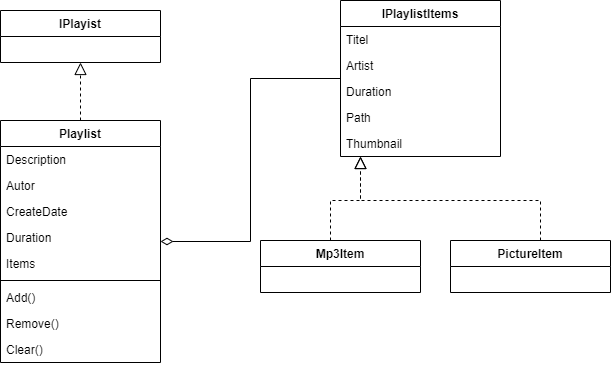
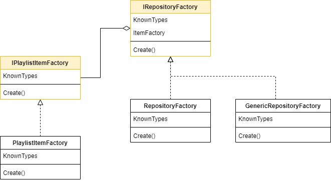

# Playlist Generator

## Anforderungen
- In einer Playlist sollen auch andere Medien wie Bilder oder Videos verwaltet werden können. Die Typ-Liste soll einfach erweiterbar sein. 

- Das Laden und Speichern verschiedener Playlistformate soll möglich sein. Die Typ-Liste soll einfach erweiterbar sein.

- Für PlaylistItems sollen immer Thumbnails angezeigt werden

- Für Details über mp3-Files soll eine Mediendatenbank kontaktiert werden (imdb, discogs)

- Bei neuen Item- und Playlist-Typen soll so gut wie kein bestehender Code geändert werden müssen. 

- Komponenten sollen einzeln getestet werden können

- Abhängigkeiten (Erzeugung- und Nutzungsabhängigkeiten) sollen reduziert werden

- Folgende UI Elemente sollen vorhanden sein => siehe Abbildung unten!

## Architektur

### Die Playlist-Daten

### Persistenz Ebene

### Factories

